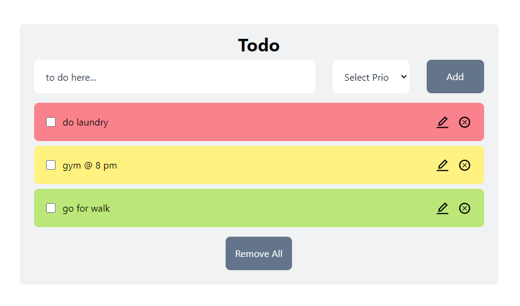

## TODO app React

This is a TODO app built using React, leveraging Context API and localStorage for state management and data persistence.

### Main Concepts

- **Conditional Rendering**: Display different UI elements based on the application's state.
- **Destructuring**: Extract values from arrays or objects into distinct variables.
- **Functional Programming**: Utilize methods like `map`, `filter`, and `find` to handle data.
- **useContext**: Manage global state across the application.
- **useState**: Handle component-level state.
- **useEffect**: Manage side effects such as data fetching and subscriptions.

### UI

- **Tailwind CSS**: For styling the application.
- **React Icons**: For adding icons to the UI.

### Other Packages

- **uuid**: For generating unique IDs for tasks.

### Built with

- [React](https://reactjs.org/) - JS library
- [Vite](https://vitejs.dev/guide/) - build tool
- [TailwindCss](https://tailwindcss.com/docs/) - For styling

### Usage

- add tasks using the input field and manage task priorities using dropdown menu (High,Medum,Low)
- edit and delete tasks as needed

### Screenshort

 
### What I learned

- How to use Context api for global state management 
- A better understanding of conditional rendering 
- How to use useEffect for handling side effects ie in this case local storage and a better understanding of local storage
- A better undestanding of functional programming, destructuring, 

### Links

- Live Site URL: [Here](https://disismeg31.github.io/todo-app/)

